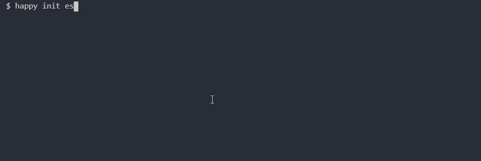

# Happy-Init

Happy-Init is a cli tool that help you develop and release npm package easily.

A robust npm package should concern following aspects:

- code style: prettier...
- code quality: eslint,unit test...
- code compilation tool: babel,webpack...
- git hooks: precommit,prepublish...
- release flow: git actions
- documentation: README.md,CHANGELOG.md...

Happy-Init provides multiple kinds of boilerplate package,includes:

- [x] ES package
- [ ] TS package
- [ ] React component package

Each boilerplate contains complete development dependencies and workflow from initialization to release.

> Initial easily, develop quickly, publish confidently.

## Installation 

```shell
$ npm install happy-init -g
```

## Usage

```shell
$ happy init [es|ts|react]
```

Happy-Init will download specific boilerplate package files and install dependencies.



## Cli Args

| args             | description                                             |
| ---------------- | ------------------------------------------------- |
| -v, --version    | show the version of Happy-Init                                    |
| -h, --help       | show the help info                                     |
| init [template] | initial specific boilerplate package files and install dependencies |
